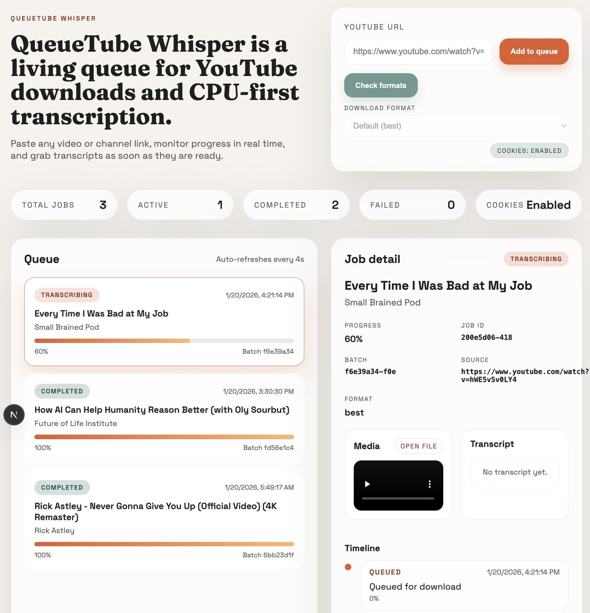

# QueueTube Whisper Transcriber

A production-ready, CPU-first pipeline for downloading YouTube videos and transcribing them with faster-whisper. The stack uses FastAPI + Celery + Redis with durable job tracking and a Next.js frontend.

## ✨ Features

- 🎥 **YouTube download queue** via yt-dlp
- 🎤 **Fast CPU transcription** with faster-whisper (no GPU required)
- 🧾 **Persistent job tracking** with SQLite (Postgres-ready)
- 📈 **Progress + event timeline** for every job
- 🐳 **Docker-first** local dev + deploy
- 🌐 **Web UI** (Next.js) and API docs

## 🖼️ UI Preview



## 🧱 Architecture

```
┌─────────────────┐    ┌─────────────────┐    ┌─────────────────┐
│   Frontend      │    │   FastAPI       │    │   Redis         │
│   (Next.js)     │◄──►│   API Server    │◄──►│   Queue Broker  │
│   Port: 3000    │    │   Port: 8000    │    │   Port: 6379    │
└─────────────────┘    └─────────────────┘    └─────────────────┘
                                │
                ┌───────────────┼───────────────┐
                ▼               ▼               ▼
    ┌─────────────────┐ ┌─────────────────┐ ┌─────────────────┐
    │ Celery Download │ │ Celery Transc.  │ │ Flower Monitor  │
    │ Worker          │ │ Worker          │ │ Port: 5556      │
    └─────────────────┘ └─────────────────┘ └─────────────────┘
```

## 🚀 Quick Start

### Prereqs

- Docker + Docker Compose
- 4GB+ RAM (model loading)

### Start the stack

```bash
docker compose up --build
```

### Access services

- Frontend: http://localhost:3000
- API: http://localhost:8000
- API Docs: http://localhost:8000/docs
- Flower: http://localhost:5556

## 🧪 Example API calls

### Create a job batch

```bash
curl -X POST "http://localhost:8000/jobs" \
  -H "Content-Type: application/json" \
  -d '{"url": "https://www.youtube.com/watch?v=dQw4w9WgXcQ"}'
```

### List jobs

```bash
curl "http://localhost:8000/jobs"
```

### Fetch job events

```bash
curl "http://localhost:8000/jobs/<job_id>/events"
```

### Legacy endpoints

```bash
curl -X POST "http://localhost:8000/download_url" \
  -H "Content-Type: application/json" \
  -d '{"url": "https://www.youtube.com/watch?v=dQw4w9WgXcQ"}'

curl -X POST "http://localhost:8000/process_untranscribed_videos"
```

## 🖥️ Frontend dev

Set the API base URL if your frontend runs outside Docker:

```bash
export NEXT_PUBLIC_API_BASE=http://localhost:8000
```

## ⚙️ Configuration

Environment variables are prefixed with `QTUBE_`.

```bash
QTUBE_REDIS_URL=redis://redis:6379/0
QTUBE_DATABASE_URL=sqlite:///./data/qtube.db
QTUBE_DOWNLOADS_DIR=downloads
QTUBE_WHISPER_MODEL=base.en
QTUBE_TRANSCRIPTION_DEVICE=cpu
QTUBE_TRANSCRIPTION_COMPUTE_TYPE=int8
QTUBE_CORS_ORIGINS=["*"]
QTUBE_YTDLP_COOKIES_FILE=/app/config/yt-cookies.txt
```

## 🍪 yt-dlp cookies (optional)

YouTube will often require cookies + a JS runtime for reliable downloads.
This image installs Deno automatically and enables the EJS challenge solver
via GitHub-hosted components. To add cookies:

1. Export cookies to a Netscape-format text file.
2. Place it at `./config/yt-cookies.txt` (mounted into the container).
3. Ensure `QTUBE_YTDLP_COOKIES_FILE=/app/config/yt-cookies.txt` is set (already in docker-compose).

```bash
QTUBE_YTDLP_COOKIES_FILE=/app/config/yt-cookies.txt
```

## 📁 Project Layout

```
queuetube-whisper-transcriber/
├── app/                          # Backend (FastAPI + Celery)
├── frontend/                     # Next.js UI
├── downloads/                    # Downloaded media + transcripts
├── models/                       # Whisper model cache
├── data/                         # SQLite database
├── docker-compose.yml
├── Dockerfile
└── pyproject.toml
```

## ✅ Testing

```bash
uv pip install --system -e .[dev]
pytest
```

## 🔁 Migration notes

- Backend now persists jobs in `data/qtube.db` (SQLite by default).
- New API entrypoint: `POST /jobs` (legacy `/download_url` still works).
- Whisper engine switched to `faster-whisper` for CPU performance.
- Frontend moved to Next 15 + TypeScript with testing (Vitest + Playwright).
